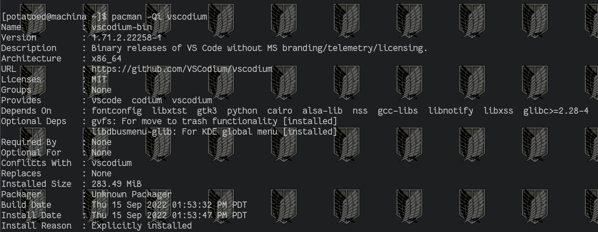

# Week 1 Lab Report
---

## How to use ssh, scp, and some basics

 
###**1) Installing ~~VS CODE~~ VS-CODIUM**

While VS-Code is still open source, it is created for purposes intended by microsoft.

Get rid of the telemetry. Install VS-Codium

On my system: `sudo pacman -S vscodium-bin` (We're not compiling it ourself.)

I'm not downloading it again so I'm using `pacman -Qi vscodium` to just read some stuff.

As it says under its package information it is basically vscode.

I have coded in daylight and I needed a good light mode so I changed it to look like this:

 
###**2) Remotely Connecting (ssh)**

Obviously we want to establish an ssh connection. This "secure shell" is done by writing out `ssh <user>@<hostname>`. That should be it most of the time. I did the same thing when I was logging into my rasberry pi once too. Perfectly fine. In this case our user would be cs15lfa22zz or something similar because that is the username for the class. And hostname on the UCSD cluster is ieng6.ucsd.edu. 

You can find more about your user [here](https://sdacs.ucsd.edu/~icc/index.php)
Make sure to reset your password!

So remoting into my user would look like `ssh cs15lfa22ca@ieng6.ucsd.edu`

It will ask you if you want to continue connecting only the first time you ssh.

###**3) **Trying some commands (cmon I know this)**
    
I know some of the basic commands. I know that `cd`, `mkdir`, `rmdir`, `mv`, etc. I use them almost every day. But maybe I'll list some of my favorite info.
Adding the "-l" flag to ls is more likeable if I want information on permssions and time. 
The "find" command is very helpful to search. Usually I use it as `find <path_parent> -name <file_name>`
And of course the grep command. The command gives me a line with the expression I am looking for. Like `grep <file_name> <regex_expression>`

###**4) **Moving files with scp**

ftp stands for file transfer protocol. scp only stands for secure copy. No protocol, big sad.

Anyways, to use it's pretty obvious how. 
Just use `scp <target_file> <user>@<hostname>:<file_path/file_name>`

That's all it is. Make sure to specify the file path location! I had a friend of mine not  have it work because he left the area after the colon blank. Also to copy something from host to client just reverse the order of the arguements. Easy!

###**5) Setting a ssh key**
 
So of course we don't want to have to enter our password. I didn't figure this out when I used the rasberry pi. Small brain.

Basically on my client I will run `ssh-keygen` which generates a key. Running it I see it places it under "~/.ssh/". We are interested in using the public key, so the file named "id_rsa.pub" or something like that.

Anyways, we will secure copy this user and place the contents of this file in our remote computer. We use scp again but this time place it in "~/.ssh/authorized_keys". Since we're just allowing only one user we can just place 'id_rsa' into '.ssh/' directory and rename it to 'authorized_keys'.
    

###**6) Optimize, configure. We are the linux user.**
 
It is our destiny. We optimize and configure. We tweak to our needs and wants. We are the linux user.

TWEAK IT. TWEAK IT.
CHANGE THE RC HAHAHAHAHA.
In this case it looks like changing the .bashrc isn't sourcing properly after every session.
However! '.bash_profile' is. So I have put some commands that I want to run automatically when I enter a session.

[Link back](index.md)
