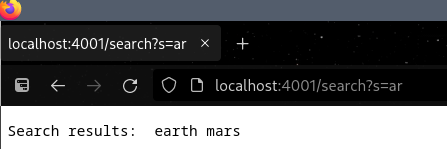
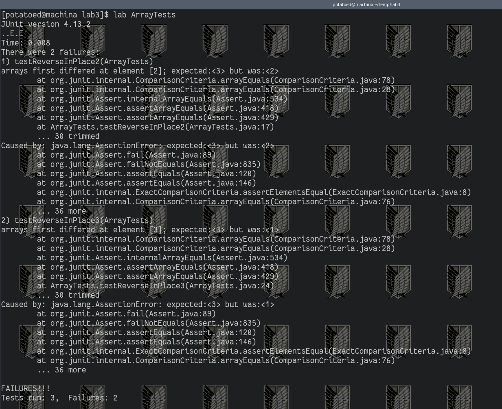

# Week 2 Lab Report
---

## 1) Simple Search Engine

We created a small http server using java. The code is towards the end of this section. It is very simple, handling url's and storing up to 100 words and leaving them to be searched. 
Nothing fancy, just practice setting it and turning it on, as well as a naive approach to searching.

First we compile all java files needed for the server, then run it with java. 


Notice that we specify another argument for java. This is because "SearchEngine.java" also takes in a number. I believe the number of port it takes in must be a registered port, which would be a number 1024-49151. So in my case I choose 4001. After than I opened my browser and for the url entered `http://localhost:4001`. 


Now as a reminder what the path and queries are depends on how we handle them. For that reason the code under the `Handler` class will handle such a thing. For this part of the lab we wish to be able to add words and later search for them using substrings. Note that in the constructor the saved words is limited to 100 words. This is just hard coded to prevent saving too many words, which shouldn't happen.

```
// The following adds the three words, "word1", "word2" and "word3" to the saved words.
http://localhost:4001/add?s=word1
http://localhost:4001/add?s=word2
http://localhost:4001/add?s=word3

// the following searches for "rd3" substring in the words added in the past. The query is not added.
http://localhost:4001/search?s=rd3

```

Also worth mentioning that although there is methods `addWord()` and `searchWord` that prepare for "/add" and "/search", there is also "/all" just to print all the words saved into string_history[] and used for viewing all words, but for the sake of being concise and related to the work this won't be mentioned later. 

```
import java.io.IOException;
import java.net.URI;

class Handler implements URLHandler {
    // The one bit of state on the server: a number that will be manipulated by
    // various requests.

    String[] string_history;
    int str_ind;


    public Handler() {
        int MAX_STRING_HISTORY = 100; // Just to avoid adding too many words
        string_history = new String[MAX_STRING_HISTORY];
	    str_ind = 0;
    }


    private void addWord(String word) {
        string_history[str_ind] = word;
        str_ind++;
    
    }

    private String searchWord(String word) {
        int t = 0;
        String found = "";

        while(t < str_ind) {
            if (string_history[t].contains(word))
                found = String.format("%s %s", found, string_history[t]);
	    t++;

        }
        return found;
    }


    public String handleRequest(URI url) {
        if (url.getPath().equals("/")) 
            return "Well it's up";

        else if (url.getPath().equals("/search")) {
            String[] parameters = url.getQuery().split("=");
            if (parameters[0].equals("s")) 
                return String.format("Search results: %s",searchWord(parameters[1]));
	    	

        } else if (url.getPath().equals("/add")) {
            //System.out.println("Path: " + url.getPath());
            String[] parameters = url.getQuery().split("=");
            if (parameters[0].equals("s")) {
                addWord(parameters[1]);
		            return String.format("Added %s", parameters[1]);
                //return nothing
            } else
                return String.format("Failed to add word");
        } else if (url.getPath().equals("/all")) {
            //System.out.println("Path: " + url.getPath());
            if (str_ind == 0)
                return String.format("No words added yet");

            int t = 0;
            String found = string_history[t++];
    
            while(t < str_ind) {
                found = String.format("%s, %s", found, string_history[t]);
		        t++;
            }
            

	          return String.format("All are %s", found);
        }

        return "404 Not Found!";
    }
}

class SearchEngine {
    public static void main(String[] args) throws IOException {
        if(args.length == 0){
            System.out.println("Missing port number! Try any number between 1024 to 49151");
            return;
        }

        int port = Integer.parseInt(args[0]);

        Server.start(port, new Handler());
    }
}
```
As an example of how it works the following are a series of images of entering url's and querying to add new words and search for phrases.


  No search yet. Since it is a url handleRequest() is run, with the block checking for the path equaling "\search". This calls the public method searchWord() with the argument being the String in the query, "mars". It splits the query and is taking the String that follows "s=", but before the next "=". But at this time in the program no words are recorded. Since it is empty it will return nothing. So the page returns an empty list by saying "Search results:" followed by where there would be the String that would return words that were found.


Similarly handleRequest() takes the url and interprets what it should do with the path. As it includes "\add" in the path and a query it runs the corresponding block in the handleRequest() method. It splits the query with '=' and takes a String if it is proceeded by an 's'. Afterwards it calls addWord() with the String after the '=' as an argument. In this examples in the query the String would be "Uranus". It then adds the word to an array called string_history, with a max of 100 Strings. 

After this example a similar url was pasted with queries of mercury, jupiter, earth, etc. The planets of our solar system.



Finally we retry to search. How it works is similar to our first example. But this time we have the names of the planets of our solar system saved in our string_history[]. The handleRequest calls searchWord() with the String "ar". Since now we have the planets of the solar system added, it finds this pattern twice: "mars" and "earth". Thus the method handleRequest returns "Search results: " followed by the results "earth mars". 

## 2) Debugging

### a) Bug 1, Arrays Example

```
public class ArrayTests {
	@Test 
	public void testReverseInPlace1() {
    int[] input1 = { 3 };
    ArrayExamples.reverseInPlace(input1); // added assignment of reversed
    assertArrayEquals(new int[]{ 3 }, input1);
	}
  @Test
	public void testReverseInPlace2() {
    int[] input1 = { 5, 3, 2, 1 };
    ArrayExamples.reverseInPlace(input1); // added assignment of reversed

    assertArrayEquals(new int[]{ 1, 2, 3, 5 }, input1);
	}
  
  @Test
	public void testReverseInPlace3() {
    int[] input1 = { 2, 3, 2, 1, 4 };
    ArrayExamples.reverseInPlace(input1); // added assignment of reversed
    assertArrayEquals(new int[]{ 4, 1, 2, 3, 2 }, input1);
	}
```

From the test only two of the tests fail. They are the second and the third test. As it says the third element is the first wrong value for the second test (2 isntead of 3), and at the fourth element instead of 3 it is 1 for the third test.



But why does this happen? The fact that it passed the first test, the one with one element gives us a clue. And that in both tests 2 and three it got past halfway until there was an incorrect value tells us more. But definitively when we read the code and look for the bug:

```
  // Changes the input array to be in reversed order
  static void reverseInPlace(int[] arr) {
    for(int i = 0; i < arr.length; i += 1) {
      arr[i] = arr[arr.length - i - 1];
    }
  }
```

What we can see is that it will correctly bring half of the back values to the front, but by the time the index of i passes the center, all of the values of the previous arr[i] have been erased, so while it overwrites the second half of arr, it does not overwrite the elements of the later half with previous elements because they are now the same.

One quick way I chose to fix it is to include a swap variable and include it:
```
  // Changes the input array to be in reversed order
  static void reverseInPlace(int[] arr) {
    int swap;
    for(int i = 0; i < arr.length/2; i += 1) { // divide by 2, don't unreverse the array
      swap = arr[i];
      arr[i] = arr[arr.length-i-1];
      arr[arr.length - i - 1] = swap;
    }
  }
```

### b) Bug 2, List Example

For the test we try to merge at first just two simple Lists with one item. 
The second test tries to merge two Lists but with 2 and 3 strings. Both adhere to the ordered alphabetically requirement.

```
  @Test
  public void testMerge() {
  
    List<String> list = Arrays.asList("test");
    List<String> list2 = Arrays.asList("two");
    List<String> expected = Arrays.asList("test","two");
    List<String> result = ListExamples.merge(list, list2);
  
    assertArrayEquals(expected.toArray(), result.toArray());
  
  }
     

  @Test
  public void testMerge2() {
  
    List<String> list = Arrays.asList("aab", "aabc");
    List<String> list2 = Arrays.asList("aaba", "aabd", "za");
    List<String> expected = Arrays.asList("aab","aaba", "aabc", "aabd", "za");

    List<String> result = ListExamples.merge(list, list2);
  
    assertArrayEquals(expected.toArray(), result.toArray());
  
  }
```


Unfortunately it doesn't look like it worked. There seems to be a bug. And based on the test saying "OutOfMemoryError" then a good assumption is that it may of reached an infinite loop at some point. Or that the loop control is faulty. This happened for both ones. 


```
  // Takes two sorted list of strings (so "a" appears before "b" and so on),
  // and return a new list that has all the strings in both list in sorted order.
  static List<String> merge(List<String> list1, List<String> list2) {
    List<String> result = new ArrayList<>();
    int index1 = 0, index2 = 0;
    while(index1 < list1.size() && index2 < list2.size()) {
      if(list1.get(index1).compareTo(list2.get(index2)) < 0) {
        result.add(list1.get(index1));
        index1 += 1;
      }
      else {
        result.add(list2.get(index2));
        index2 += 1;
      }
    }
    while(index1 < list1.size()) {
      result.add(list1.get(index1));
      index1 += 1;
    }
    while(index2 < list2.size()) {
      result.add(list2.get(index2));
      index1 += 1;
    }
    return result;
  }
```

What we can see is that it looks like a pretty standard way of looping through both lists in the first loop. Again in the following two, but something is wrong. the second and third loops should look nearly identical, only switching out 1 with 2. But the third loop never increases the counter, so if index2 is less than list2, then there will be an infinite loop. In other words if the last element of list1 comes before list2, then there will be an infinite loop. A quick fix is replacing index1 with index2 in that third loop.


[Link back](index.md)