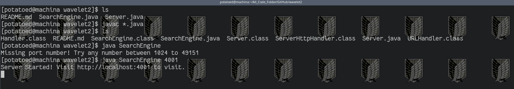

# Week 2 Lab Report
---

## 1) Simple Search Engine

```
import java.io.IOException;
import java.net.URI;

class Handler implements URLHandler {
    // The one bit of state on the server: a number that will be manipulated by
    // various requests.

    String[] string_history;
    int str_ind;


    public Handler() {
        int MAX_STRING_HISTORY = 100; // Just to avoid adding too many words
        string_history = new String[MAX_STRING_HISTORY];
	str_ind = 0;
    }


    private void addWord(String word) {
        string_history[str_ind] = word;
        str_ind++;
    
    }

    private String searchWord(String word) {
        int t = 0;
        String found = "";

        while(t < str_ind) {
            if (string_history[t].contains(word))
                found = String.format("%s %s", found, string_history[t]);
	    t++;

        }
        return found;
    }


    public String handleRequest(URI url) {
        if (url.getPath().equals("/")) {
            return "Well it's up";

        } else if (url.getPath().equals("/search")) {
            String[] parameters = url.getQuery().split("=");
            if (parameters[0].equals("s")) 
                return String.format("searched and: %s",searchWord(parameters[1]));
	    	

        } else if (url.getPath().equals("/add")) {
            //System.out.println("Path: " + url.getPath());
            String[] parameters = url.getQuery().split("=");
            if (parameters[0].equals("s")) {
                addWord(parameters[1]);
		return String.format("Added %s", parameters[1]);
                //return nothing
	    }
        } else if (url.getPath().equals("/all")) {
            //System.out.println("Path: " + url.getPath());
            int t = 0;
            String found = "";
    
            while(t < str_ind) {
                found = String.format("%s, %s", found, string_history[t]);
		t++;
            }

	    return String.format("All are %s", found);
        }

        return "404 Not Found!";
    }
}

class SearchEngine {
    public static void main(String[] args) throws IOException {
        if(args.length == 0){
            System.out.println("Missing port number! Try any number between 1024 to 49151");
            return;
        }

        int port = Integer.parseInt(args[0]);

        Server.start(port, new Handler());
    }
}
```




## 2) Debugging


[Link back](index.md)