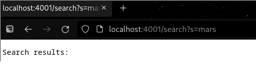
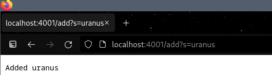

# Week 2 Lab Report
---

## 1) Simple Search Engine

We created a small http server using java. The code is towards the end of this section. It is very simple, handling url's and storing up to 100 words and leaving them to be searched. 
Nothing fancy, just practice setting it and turning it on, as well as a naive approach to searching.

First we compile all java files needed for the server, then run it with java. 


Notice that we specify another argument for java. This is because "SearchEngine.java" also takes in a number. I believe the number of port it takes in must be a registered port, which would be a number 1024-49151. So in my case I choose 4001. After than I opened my browser and for the url entered `http://localhost:4001`. 


Now as a reminder what the path and queries are depends on how we handle them. For that reason the code under the `Handler` class will handle such a thing. For this part of the lab we wish to be able to add words and later search for them using substrings. Note that in the constructor the saved words is limited to 100 words. This is just hard coded to prevent saving too many words, which shouldn't happen.

```
// The following adds the three words, "word1", "word2" and "word3" to the saved words.
http://localhost:4001/add?s=word1
http://localhost:4001/add?s=word2
http://localhost:4001/add?s=word3

// the following searches for "rd3" substring in the words added in the past. The query is not added.
http://localhost:4001/search?s=rd3

```

Also worth mentioning that although there is methods `addWord()` and `searchWord` that prepare for "/add" and "/search", there is also "/all" just to print all the words saved into string_history[] and used for viewing all words, but for the sake of being concise and related to the work this won't be mentioned later. 

```
import java.io.IOException;
import java.net.URI;

class Handler implements URLHandler {
    // The one bit of state on the server: a number that will be manipulated by
    // various requests.

    String[] string_history;
    int str_ind;


    public Handler() {
        int MAX_STRING_HISTORY = 100; // Just to avoid adding too many words
        string_history = new String[MAX_STRING_HISTORY];
	    str_ind = 0;
    }


    private void addWord(String word) {
        string_history[str_ind] = word;
        str_ind++;
    
    }

    private String searchWord(String word) {
        int t = 0;
        String found = "";

        while(t < str_ind) {
            if (string_history[t].contains(word))
                found = String.format("%s %s", found, string_history[t]);
	    t++;

        }
        return found;
    }


    public String handleRequest(URI url) {
        if (url.getPath().equals("/")) 
            return "Well it's up";

        else if (url.getPath().equals("/search")) {
            String[] parameters = url.getQuery().split("=");
            if (parameters[0].equals("s")) 
                return String.format("Search results: %s",searchWord(parameters[1]));
	    	

        } else if (url.getPath().equals("/add")) {
            //System.out.println("Path: " + url.getPath());
            String[] parameters = url.getQuery().split("=");
            if (parameters[0].equals("s")) {
                addWord(parameters[1]);
		            return String.format("Added %s", parameters[1]);
                //return nothing
            } else
                return String.format("Failed to add word");
        } else if (url.getPath().equals("/all")) {
            //System.out.println("Path: " + url.getPath());
            if (str_ind == 0)
                return String.format("No words added yet");

            int t = 0;
            String found = string_history[t++];
    
            while(t < str_ind) {
                found = String.format("%s, %s", found, string_history[t]);
		        t++;
            }
            

	          return String.format("All are %s", found);
        }

        return "404 Not Found!";
    }
}

class SearchEngine {
    public static void main(String[] args) throws IOException {
        if(args.length == 0){
            System.out.println("Missing port number! Try any number between 1024 to 49151");
            return;
        }

        int port = Integer.parseInt(args[0]);

        Server.start(port, new Handler());
    }
}
```
As an example of how it works the following are a series of images of entering url's and querying to add new words and search for phrases.

No search yet



Adding queries, mercury, jupiter, earth, etc. The planets of our solar system.



And finally again searching for a word. But this time searching for any of the words with "ar" in it.


## 2) Debugging


[Link back](index.md)