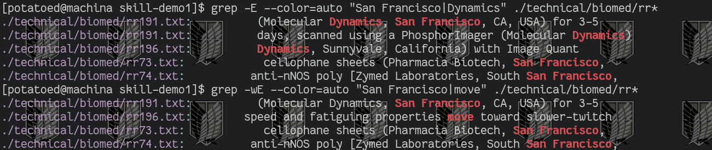

# Week 5 Lab Report
---

## 1) GREP

For this lab report we will be focusing on grep. By far it is the one with more that I don't know and more to offer thatn than `less` or `find`, though I think `find` and some of it's options may be useful to learn later. But grep is useful in many contexts. And I need to review it. I remember that egrep, now `grep -e` is I think for regex expressions. I have used `--` as a flag to escape `-`, and somehow I think `-o` flag to look for multiple expressions. Either way for this lab I will look at three examples of flags for grep. I will also list out some useful ones but the less work I have to type out, format, and paste pictures on the lab is more practice time for me in the terminal and messing around with linux.

For starters `grep` seems to come from `g/re/p`, or a global search of a regular expression, then print. It reminds me of the substiture command in vim. For more information off wiki read [here](https://en.wikipedia.org/wiki/Grep). 

Let's see a first flag: 

**The -w flag.**

This one will just make sure you are looking for a word. Let's look at some examples:

```
[potatoed@machina skill-demo1]$ grep --color=auto "move" ./technical/biomed/rr*
./technical/biomed/rr166.txt:          isopropyl alcohol. Isopropyl alcohol was removed by
./technical/biomed/rr167.txt:          Unincorporated NaI or Na 125I was removed by solid phase
./technical/biomed/rr167.txt:          g for 30 min at 20°C to remove the
./technical/biomed/rr167.txt:          2 O to remove any residual salt and
./technical/biomed/rr167.txt:        sensor chip ("butter-side down") probably removes them from
./technical/biomed/rr171.txt:        Neutrophils are relatively short-lived cells removed
./technical/biomed/rr171.txt:          lavaged 5-6 times with HBSS to remove alveolar
./technical/biomed/rr171.txt:          migrated neutrophils was removed and stained with Camco
./technical/biomed/rr172.txt:          to remove serum factors. Assays were done in triplicate
./technical/biomed/rr172.txt:        remove serum factors. Assays were done in triplicate and
./technical/biomed/rr196.txt:          After study, the strip was removed from the apparatus,
./technical/biomed/rr196.txt:        speed and fatiguing properties move toward slower-twitch
./technical/biomed/rr196.txt:        consumed by the ATPase responsible for movement of the
./technical/biomed/rr37.txt:          asthma over longitudinal follow-up, we removed
./technical/biomed/rr73.txt:            sheath and other connective tissue were removed
./technical/biomed/rr74.txt:          was removed and animals were sorted by sex. At 6 weeks
./technical/biomed/rr74.txt:          animals of both sexes were removed for study.
./technical/biomed/rr74.txt:          min, and plasma removed and frozen. Later, samples were
[potatoed@machina skill-demo1]$ grep --color=auto -w "move" ./technical/biomed/rr*
./technical/biomed/rr196.txt:        speed and fatiguing properties move toward slower-twitch
```

Here is the example once again, but as an image below. Since directions say code block I will be inputting codeblock out of necessity, but the picture shows it better. I will be including a picture alongside a code block when I feel it is is better to look at or is necessary for the rest of the report..
I also included the use of color just for easier legibility.


In the previous example we first grepped for the expression "move" inside ./technical/biomed/rr*, where r* is a wildcard. What we got were a lot of words that had the phrase "move" in it, but maybe weren't what we wanted. Adding the -w flag looked for the word itself, instead of just the the letters.

But what if we had input the expression with spaces? Like would it have been fine if did `grep " move " [filename]`? I don't think so. Consider:

```
[potatoed@machina skill-demo1]$ grep --color=auto " added " ./technical/biomed/rr*
./technical/biomed/rr166.txt:          μM of arachidonic acid was added to the plates. After 30
./technical/biomed/rr166.txt:          1α were added to the supernatants with
./technical/biomed/rr167.txt:          added to the supernatant and incubated at 37°C overnight
./technical/biomed/rr167.txt:          2 in 95% ethanol was added and the
./technical/biomed/rr167.txt:          temperature before protease (25 μg/ml) was added and
./technical/biomed/rr167.txt:          and added to the radial diffusion wells. After a 3-hour
./technical/biomed/rr167.txt:        added to the well, some of the initially added protegrin
./technical/biomed/rr171.txt:          incubation at 37°C, RNase H -(2 U) was added and the
./technical/biomed/rr171.txt:          added to the reaction mixtures prior to addition of the
./technical/biomed/rr191.txt:          (dilute HCl) was added for an additional 12-16 hours.
./technical/biomed/rr191.txt:          rapamycin is ~0.04-0.4 nM [ 13 ] . When added alone at
./technical/biomed/rr191.txt:          added alone.
./technical/biomed/rr191.txt:          phosphorylation when added alone (Figs. 6Dand 6F).
./technical/biomed/rr191.txt:        However, PD98059, added alone, abolished p44/42 MAPK
./technical/biomed/rr73.txt:          2 (0.1 μM) was added to the
./technical/biomed/rr74.txt:          Plasma samples 1 μl were added to 2 ml vanadium III
[potatoed@machina skill-demo1]$ grep --color=auto -w "added" ./technical/biomed/rr*
./technical/biomed/rr166.txt:          μM of arachidonic acid was added to the plates. After 30
./technical/biomed/rr166.txt:          1α were added to the supernatants with
./technical/biomed/rr166.txt:          internal standards had been added.
./technical/biomed/rr167.txt:          added, and the mixture was incubated at 37°C for 2 hours.
./technical/biomed/rr167.txt:          added: 5.0 ml of 0.5 M tetrasodium EDTA in 10 mM Tris
./technical/biomed/rr167.txt:          added to the supernatant and incubated at 37°C overnight
./technical/biomed/rr167.txt:          2 in 95% ethanol was added and the
./technical/biomed/rr167.txt:          temperature before protease (25 μg/ml) was added and
./technical/biomed/rr167.txt:          and added to the radial diffusion wells. After a 3-hour
./technical/biomed/rr167.txt:        added to the well, some of the initially added protegrin
./technical/biomed/rr171.txt:          incubation at 37°C, RNase H -(2 U) was added and the
./technical/biomed/rr171.txt:          added to the reaction mixtures prior to addition of the
./technical/biomed/rr191.txt:          (dilute HCl) was added for an additional 12-16 hours.
./technical/biomed/rr191.txt:          rapamycin and PD98059 (Fig. 1Band 1C). Wortmannin, added
./technical/biomed/rr191.txt:          in vitro [ 12 ] . LY294002, added
./technical/biomed/rr191.txt:          rapamycin is ~0.04-0.4 nM [ 13 ] . When added alone at
./technical/biomed/rr191.txt:          50 of 10 μM [ 9 ] . PD98059, added
./technical/biomed/rr191.txt:          added alone.
./technical/biomed/rr191.txt:          phosphorylation when added alone (Figs. 6Dand 6F).
./technical/biomed/rr191.txt:        However, PD98059, added alone, abolished p44/42 MAPK
./technical/biomed/rr73.txt:          2 (0.1 μM) was added to the
./technical/biomed/rr73.txt:        contraction and degraded the extracellular matrix. NE added
./technical/biomed/rr74.txt:          methylsulfonyl fluoride was added. Samples were
./technical/biomed/rr74.txt:          Plasma samples 1 μl were added to 2 ml vanadium III

```


For this example we search for the word added.
So there's a lot of output, but they seem to be showing the correct one right? So what is the problem? Take file rr167.txt and rr74.txt.
These files have thw word added with another character immediately next to it. So if we grep incorrectly we don't get ":added" or "added.". This is one reason why the word flag can be handly if working with words as we know them. (If you are working with numbers this flag may work but there are better ways though.)

Here is a third example:

```

[potatoed@machina skill-demo1]$ grep --color=auto "due" ./technical/biomed/rr*
./technical/biomed/rr166.txt:          After evaporation of reagents, the residue was subjected
./technical/biomed/rr166.txt:        of its apparent role in atherosclerosis, due to its
./technical/biomed/rr166.txt:        due to decreased COX-2 expression [ 12 ] . There is a
./technical/biomed/rr166.txt:        diagnostic accuracy of our patient population was high, due
./technical/biomed/rr167.txt:          tyrosine residue was present. In this report the modified
./technical/biomed/rr167.txt:          acid contamination was considered to be minimal due to
./technical/biomed/rr167.txt:        due to cytoplasmic clearance of the antimicrobial peptide
./technical/biomed/rr167.txt:        each glucosamine residue. In the lipid A of 
./technical/biomed/rr167.txt:        4-amino-4-deoxyarabinose residue [ 58 59 ] . It is
./technical/biomed/rr167.txt:        B. cepacia to protegrin is due
./technical/biomed/rr167.txt:        single tyrosine residue; HEPES =
./technical/biomed/rr171.txt:        adherent neutrophils in the lung vasculature is due to the
./technical/biomed/rr171.txt:        may be due to unique attributes of human and rat cells,
./technical/biomed/rr171.txt:        be due to an inability of the antibody to recognize
./technical/biomed/rr171.txt:        phosphorylated residues on these proteins in primary rat
./technical/biomed/rr171.txt:        our results may be due to unique attributes of rat and
./technical/biomed/rr191.txt:        inadequate amounts of pulmonary surfactant due to delayed
./technical/biomed/rr191.txt:        phosphorylates tyrosine residues in insulin receptor
./technical/biomed/rr191.txt:        rapamycin-sensitive residue (threonine 389), present in the
./technical/biomed/rr73.txt:        due to NE activation of latent MMPs induced in the
./technical/biomed/rr74.txt:        increase in pulmonary pressure due to increased viscosity [
./technical/biomed/rr74.txt:        lungs, and that this was not entirely due to the presence
./technical/biomed/rr74.txt:        due to hypoxia. This is further supported by Tyler 
./technical/biomed/rr74.txt:        reported. This discrepancy may be due to differences
./technical/biomed/rr74.txt:        reported previously may be due to the combination of
./technical/biomed/rr74.txt:        due to the transcription factor hypoxia-inducible factor-1α
./technical/biomed/rr74.txt:        increased NO metabolites could also be due to decreased NOS
[potatoed@machina skill-demo1]$ grep --color=auto -w "due" ./technical/biomed/rr*
./technical/biomed/rr166.txt:        of its apparent role in atherosclerosis, due to its
./technical/biomed/rr166.txt:        due to decreased COX-2 expression [ 12 ] . There is a
./technical/biomed/rr166.txt:        diagnostic accuracy of our patient population was high, due
./technical/biomed/rr167.txt:          acid contamination was considered to be minimal due to
./technical/biomed/rr167.txt:        due to cytoplasmic clearance of the antimicrobial peptide
./technical/biomed/rr167.txt:        B. cepacia to protegrin is due
./technical/biomed/rr171.txt:        adherent neutrophils in the lung vasculature is due to the
./technical/biomed/rr171.txt:        may be due to unique attributes of human and rat cells,
./technical/biomed/rr171.txt:        be due to an inability of the antibody to recognize
./technical/biomed/rr171.txt:        our results may be due to unique attributes of rat and
./technical/biomed/rr191.txt:        inadequate amounts of pulmonary surfactant due to delayed
./technical/biomed/rr73.txt:        due to NE activation of latent MMPs induced in the
./technical/biomed/rr74.txt:        increase in pulmonary pressure due to increased viscosity [
./technical/biomed/rr74.txt:        lungs, and that this was not entirely due to the presence
./technical/biomed/rr74.txt:        due to hypoxia. This is further supported by Tyler 
./technical/biomed/rr74.txt:        reported. This discrepancy may be due to differences
./technical/biomed/rr74.txt:        reported previously may be due to the combination of
./technical/biomed/rr74.txt:        due to the transcription factor hypoxia-inducible factor-1α
./technical/biomed/rr74.txt:        increased NO metabolites could also be due to decreased NOS
[potatoed@machina skill-demo1]$ 
```


In this example we only look for the word "due", while avoiding words like "resi*due*. Again we look at the same files.

**The -E flag.**

Supposed to have replaced the now depcrated `egrep`, this flag allows us to search for more than one expression.

For example say that I want to search for all iterations that *"San Francisco :* or *"San Diego"* appear in a set of files, and I want to print those lines. I could do 

```
grep "San Francisco" [file_name]
grep "San Diego" [file_name]
```

```

[potatoed@machina skill-demo1]$ grep --color=auto "San Diego" ./technical/biomed/rr*
./technical/biomed/rr171.txt:          antibodies (Transduction Laboratories, San Diego, CA, USA
./technical/biomed/rr172.txt:          Clonetics (San Diego, CA, USA. CSC was purchased from
./technical/biomed/rr172.txt:          NHBEs (Clonetics, San Diego, CA, USA) were obtained at
./technical/biomed/rr74.txt:          Transduction Laboratories, San Diego, CA, USA]; 1:1500
[potatoed@machina skill-demo1]$ grep --color=auto "San Francisco" ./technical/biomed/rr*
./technical/biomed/rr191.txt:          (Molecular Dynamics, San Francisco, CA, USA) for 3-5
./technical/biomed/rr73.txt:            cellophane sheets (Pharmacia Biotech, San Francisco,
./technical/biomed/rr74.txt:          anti-nNOS poly [Zymed Laboratories, South San Francisco,
```


But as you can see we search inside ./techinical/biomed/rr* files, where * is a placeholder for no string of characters to any string of characters for a file. As you can see we get 7 outputs.

With the '-E' flag I can search for multiple patters seperated by the '|' delimeter.
Again, we are going to grep for the same phrases as before, but in one command. 

```
[potatoed@machina skill-demo1]$ grep -E --color=auto "San Francisco|Dynamics" ./technical/biomed/rr*
./technical/biomed/rr191.txt:          (Molecular Dynamics, San Francisco, CA, USA) for 3-5
./technical/biomed/rr191.txt:          days, scanned using a PhosphorImager (Molecular Dynamics)
./technical/biomed/rr196.txt:          Dynamics, Sunnyvale, California) with Image Quant
./technical/biomed/rr73.txt:            cellophane sheets (Pharmacia Biotech, San Francisco,
./technical/biomed/rr74.txt:          anti-nNOS poly [Zymed Laboratories, South San Francisco,
```


Great! This gives us the output of 7 lines with the phrases we are looking forward, printing new lines for each. But this begs the question though, what if we have multiple of the expressions we are searching on the same line:

```

[potatoed@machina skill-demo1]$ grep -E --color=auto "San Francisco|Dynamics" ./technical/biomed/rr*
./technical/biomed/rr191.txt:          (Molecular Dynamics, San Francisco, CA, USA) for 3-5
./technical/biomed/rr191.txt:          days, scanned using a PhosphorImager (Molecular Dynamics)
./technical/biomed/rr196.txt:          Dynamics, Sunnyvale, California) with Image Quant
./technical/biomed/rr73.txt:            cellophane sheets (Pharmacia Biotech, San Francisco,
./technical/biomed/rr74.txt:          anti-nNOS poly [Zymed Laboratories, South San Francisco,
```


In this example we can see we are grepping for "San Francisco" and "Dynamics". It outputs 5 lines. Notice that the first one has both expressions, yet only prints once. This is good information to keep in mind. Finally we finish up by searching for 'move' as well. We also make use of the word (-w) flag.

```

[potatoed@machina skill-demo1]$ grep -wE --color=auto "San Francisco|move" ./technical/biomed/rr*
./technical/biomed/rr191.txt:          (Molecular Dynamics, San Francisco, CA, USA) for 3-5
./technical/biomed/rr196.txt:        speed and fatiguing properties move toward slower-twitch
./technical/biomed/rr73.txt:            cellophane sheets (Pharmacia Biotech, San Francisco,
./technical/biomed/rr74.txt:          anti-nNOS poly [Zymed Laboratories, South San Francisco,
```


**-f**

Oh man, this is a new one. I don't know this one. But I can see this. The manpage is pretty informative on this:

"Obtain patterns from FILE, one per line.  If this option is used
multiple  times  or  is  combined with the -e (--regexp) option,
search for all patterns given.  The  empty  file  contains  zero
patterns, and therefore matches nothing."

So basically it reads off a first file and searches for the pattern in it from the following arguments. And it continues to do so. 
For starters we create a file named "file_names_to_search_for.txt" and place this as it's contents:


Then we try to put the flag to take these lines as input and grep for the expressions in "file_names_to_search_for.txt".

```

[potatoed@machina skill-demo1]$ grep -f --color=auto file_names_to_search_for.txt ./technical/biomed/rr*
grep: --color=auto: No such file or directory
```

Why didn't it work? Well it's because the filename we want to read to input the expressions for grep should come immediately after the -f flag. Let's try again.

```
[potatoed@machina skill-demo1]$ grep --color=auto -wf file_names_to_search_for.txt ./technical/biomed/rr*
./technical/biomed/rr171.txt:          antibodies (Transduction Laboratories, San Diego, CA, USA
./technical/biomed/rr172.txt:          Clonetics (San Diego, CA, USA. CSC was purchased from
./technical/biomed/rr172.txt:          NHBEs (Clonetics, San Diego, CA, USA) were obtained at
./technical/biomed/rr191.txt:          (Molecular Dynamics, San Francisco, CA, USA) for 3-5
./technical/biomed/rr191.txt:          days, scanned using a PhosphorImager (Molecular Dynamics)
./technical/biomed/rr196.txt:          previously [ 4 ] . Two animals died on the night after
./technical/biomed/rr196.txt:          Dynamics, Sunnyvale, California) with Image Quant
./technical/biomed/rr196.txt:        speed and fatiguing properties move toward slower-twitch
./technical/biomed/rr73.txt:            cellophane sheets (Pharmacia Biotech, San Francisco,
./technical/biomed/rr74.txt:          Transduction Laboratories, San Diego, CA, USA]; 1:1500
./technical/biomed/rr74.txt:          anti-nNOS poly [Zymed Laboratories, South San Francisco,

```


This time we get a proper output. I also included to -w flag to avoid words like "re*move*d". Notice how it searches for all expressions at once. I guess you could think of the command as being similar to `grep -E "line1|line2|line3|..." files_to_search`, where the lines are from the input file. 

Finally what if the input file is empty:
```
[potatoed@machina skill-demo1]$ grep --color=auto -wf file_names_to_search_for.txt ./technical/biomed/rr*
[potatoed@machina skill-demo1]$ echo $?
1
```
Well since there is nothing to search for it returns back en error. Interestingly it has no message to stdout or stderr, yet has a failed return code of 1. 

The following are useful flags that are so self explanatory I couldn't be bothered to choose them for the lab, yet are good to note:


| Flag         | Description   |
|--------------|------------|
| -i | ignore case |
| -v | omit lines with the reg. expression |
| -c | counts the number of times regex appears in file |
| -l | prints just the file names if regex is found |
| -r | include subdirectories |
| -R | include subdirectories and symlinks |
| -A [number] | prints number of line after regex line as well  |
| -B [number] | Like -A, but backwards. |
| -C [number] | Like both -A and -B |
| -n | print with line numbers |
| -q | No output stdout. Read exit code ($?) |


[Link back](index.md)