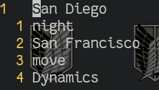

# Week 5 Lab Report
---

## 1) GREP

For this lab report we will be focusing on grep. By far it is the one with more that I don't know and more to offer thatn than `less` or `find`, though I think `find` and some of it's options may be useful to learn later. But grep is useful in many contexts. And I need to review it. I remember that egrep, now `grep -e` is I think for regex expressions. I have used `--` as a flag to escape `-`, and somehow I think `-o` flag to look for multiple expressions. Either way for this lab I will look at three examples of flags for grep. I will also list out some useful ones but the less work I have to type out, format, and paste pictures on the lab is more practice time for me in the terminal and messing around with linux.

For starters `grep` seems to come from `g/re/p`, or a global search of a regular expression, then print. It reminds me of the substiture command in vim. For more information off wiki read [here](https://en.wikipedia.org/wiki/Grep). 

Let's see a first flag: 

**The -w flag.**

This one will just make sure you are looking for a word. 


**The -E flag.**

Supposed to have replaced the now depcrated `egrep`, this flag allows us to search for more than one expression.

For example say that I want to search for all iterations that *"San Francisco :* or *"San Diego"* appear in a set of files, and I want to print those lines. I could do 

```
grep "San Francisco" [file_name]
grep "San Diego" [file_name]
```

```

[potatoed@machina skill-demo1]$ grep --color=auto "San Diego" ./technical/biomed/rr*
./technical/biomed/rr171.txt:          antibodies (Transduction Laboratories, San Diego, CA, USA
./technical/biomed/rr172.txt:          Clonetics (San Diego, CA, USA. CSC was purchased from
./technical/biomed/rr172.txt:          NHBEs (Clonetics, San Diego, CA, USA) were obtained at
./technical/biomed/rr74.txt:          Transduction Laboratories, San Diego, CA, USA]; 1:1500
[potatoed@machina skill-demo1]$ grep --color=auto "San Francisco" ./technical/biomed/rr*
./technical/biomed/rr191.txt:          (Molecular Dynamics, San Francisco, CA, USA) for 3-5
./technical/biomed/rr73.txt:            cellophane sheets (Pharmacia Biotech, San Francisco,
./technical/biomed/rr74.txt:          anti-nNOS poly [Zymed Laboratories, South San Francisco,
```

Here it is as in image. Since directions say code block I will be inputting codeblock out of necessity, but the picture shows it better.


I also included the use of color just for easier legibility. But as you can see we search inside ./techinical/biomed/rr* files, where * is a placeholder for no string of characters to any string of characters for a file. As you can see we get 7 outputs.

With the '-E' flag I can search for multiple patters seperated by the '|' delimeter.
Again, we are going to grep for the same phrases as before, but in one command. 

```
[potatoed@machina skill-demo1]$ grep -E --color=auto "San Francisco|Dynamics" ./technical/biomed/rr*
./technical/biomed/rr191.txt:          (Molecular Dynamics, San Francisco, CA, USA) for 3-5
./technical/biomed/rr191.txt:          days, scanned using a PhosphorImager (Molecular Dynamics)
./technical/biomed/rr196.txt:          Dynamics, Sunnyvale, California) with Image Quant
./technical/biomed/rr73.txt:            cellophane sheets (Pharmacia Biotech, San Francisco,
./technical/biomed/rr74.txt:          anti-nNOS poly [Zymed Laboratories, South San Francisco,
```


Great! This gives us the output of 7 lines with the phrases we are looking forward, printing new lines for each. But this begs the question though, what if we have multiple of the expressions we are searching on the same line:

```

[potatoed@machina skill-demo1]$ grep -E --color=auto "San Francisco|Dynamics" ./technical/biomed/rr*
./technical/biomed/rr191.txt:          (Molecular Dynamics, San Francisco, CA, USA) for 3-5
./technical/biomed/rr191.txt:          days, scanned using a PhosphorImager (Molecular Dynamics)
./technical/biomed/rr196.txt:          Dynamics, Sunnyvale, California) with Image Quant
./technical/biomed/rr73.txt:            cellophane sheets (Pharmacia Biotech, San Francisco,
./technical/biomed/rr74.txt:          anti-nNOS poly [Zymed Laboratories, South San Francisco,
```


In this example we can see we are grepping for "San Francisco" and "Dynamics". It outputs 5 lines. Notice that the first one has both expressions, yet only prints once. This is good information to keep in mind. Finally we finish up by searching for 'move' as well. We also make use of the word (-w) flag.

```

[potatoed@machina skill-demo1]$ grep -wE --color=auto "San Francisco|move" ./technical/biomed/rr*
./technical/biomed/rr191.txt:          (Molecular Dynamics, San Francisco, CA, USA) for 3-5
./technical/biomed/rr196.txt:        speed and fatiguing properties move toward slower-twitch
./technical/biomed/rr73.txt:            cellophane sheets (Pharmacia Biotech, San Francisco,
./technical/biomed/rr74.txt:          anti-nNOS poly [Zymed Laboratories, South San Francisco,
```


**-f**

Oh man, this is a new one. I don't know this one. But I can see this. The manpage is pretty informative on this:

"Obtain patterns from FILE, one per line.  If this option is used
multiple  times  or  is  combined with the -e (--regexp) option,
search for all patterns given.  The  empty  file  contains  zero
patterns, and therefore matches nothing."

So basically it reads off a first file and searches for the pattern in it from the following arguments. And it continues to do so. 
For starters we create a file named "file_names_to_search_for.txt" and place this as it's contents:



Then we try to put the flag to take these lines as input and grep for the expressions in "file_names_to_search_for.txt".

```

[potatoed@machina skill-demo1]$ grep -f --color=auto file_names_to_search_for.txt ./technical/biomed/rr*
grep: --color=auto: No such file or directory
```


Why didn't it work? Well it's because the filename we want to read to input the expressions for grep should come immediately after the -f flag. Let's try again.

```
[potatoed@machina skill-demo1]$ grep --color=auto -wf file_names_to_search_for.txt ./technical/biomed/rr*
./technical/biomed/rr171.txt:          antibodies (Transduction Laboratories, San Diego, CA, USA
./technical/biomed/rr172.txt:          Clonetics (San Diego, CA, USA. CSC was purchased from
./technical/biomed/rr172.txt:          NHBEs (Clonetics, San Diego, CA, USA) were obtained at
./technical/biomed/rr191.txt:          (Molecular Dynamics, San Francisco, CA, USA) for 3-5
./technical/biomed/rr191.txt:          days, scanned using a PhosphorImager (Molecular Dynamics)
./technical/biomed/rr196.txt:          previously [ 4 ] . Two animals died on the night after
./technical/biomed/rr196.txt:          Dynamics, Sunnyvale, California) with Image Quant
./technical/biomed/rr196.txt:        speed and fatiguing properties move toward slower-twitch
./technical/biomed/rr73.txt:            cellophane sheets (Pharmacia Biotech, San Francisco,
./technical/biomed/rr74.txt:          Transduction Laboratories, San Diego, CA, USA]; 1:1500
./technical/biomed/rr74.txt:          anti-nNOS poly [Zymed Laboratories, South San Francisco,

```


This time we get a proper output. I also included to -w flag to avoid words like "re*move*d". Notice how it searches for all expressions at once. I guess you could think of the command as being similar to `grep -E "line1|line2|line3|..." files_to_search`, where the lines are from the input file. 


The following are useful flags that are so self explanatory I couldn't be bothered to choose them for the lab, yet are good to note:


| Flag         | Description   |
|--------------|------------|
| -i | ignore case |
| -v | omit lines with the reg. expression |
| -c | counts the number of times regex appears in file |
| -l | prints just the file names if regex is found |
| -r | include subdirectories |
| -R | include subdirectories and symlinks |
| -A [number] | prints number of line after regex line as well  |
| -B [number] | Like -A, but backwards. |
| -C [number] | Like both -A and -B |
| -n | print with line numbers |
| -q | No output stdout. Read exit code ($?) |


[Link back](index.md)