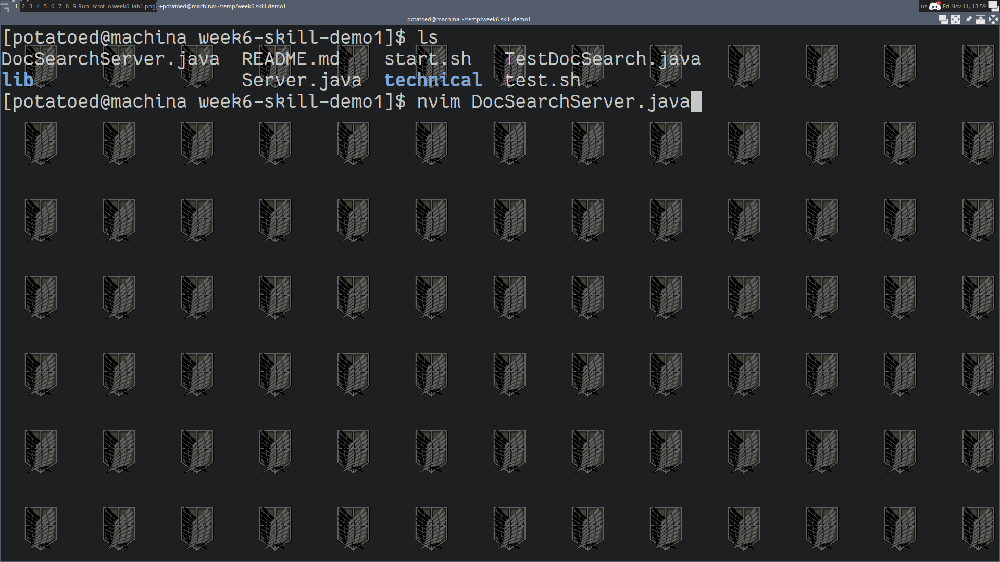
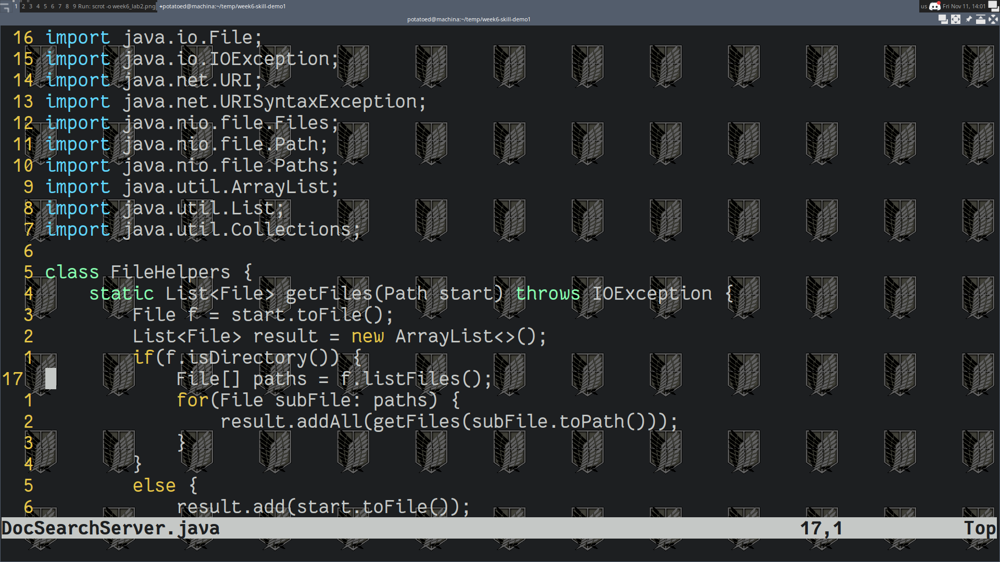
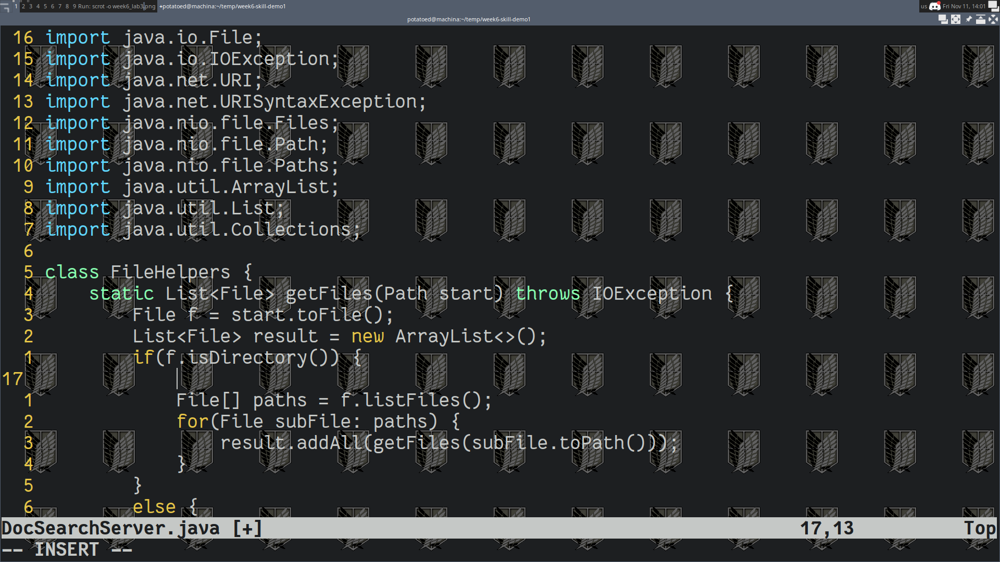
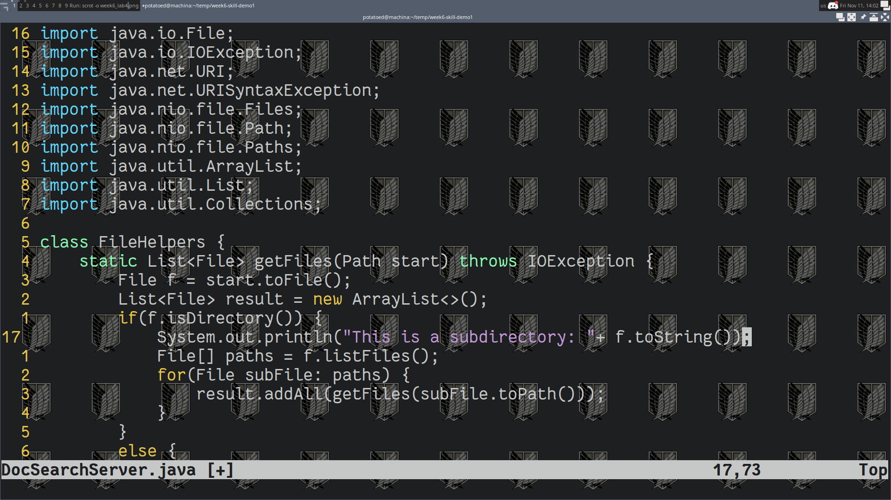
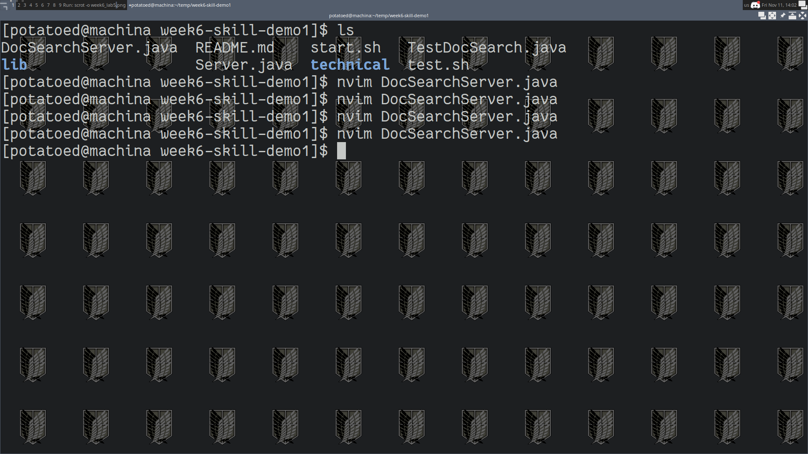

# Week 7 Lab Report
---

## Part 1: Adding a print before a line

"
In DocSearchServer.java, add a new line right before File[] paths = f.listFiles(); that prints out the toString of f and a message saying it’s a directory.
"
The first thing is to navigate to the correct directory. We git clone the project and move to where the file is:

At this point we vim into the file. You may notice a difference or two between my system as I am using neovim, as well as a few plugins changing the asthetic, but it is essentially the same.
So on my system I run `neovim DocSearchServer.java`

At this point I find the line I am interested is 16 lines down. This is where having line numbers is helpful. So from here I am interested in moving 16 down form where I am. I can do `:17`'<enter>' or enter 'g17', But I prefer just to do '16j'. Just as 'j' means to move down, '16j' will move my cursor 16 lines down.

So great, now I am 16 lines down on the line I am interested in. But I intend to add a print statment above is. No problem, vim has a command to create a new line and enter insert mode. I can do this pressing the following:
<shift>+o
While 'o' by itself would normally create a new line under my cursor, capital O (What I did above) will create a new line above it. You may notice similar behavior accross other commands, such as 'p' vs 'P'.
Now it is time to type out the code we are interested in. And this might put us above the 30-key press goal but what are we going to do about it? We're writing the code itself. And yeah, having a plug in that autocompletes would also be nice, but I have not installed anything like that yet and wouldn't be a vim feature out of the box, so it feels unfair.

Great, now we have entered insert mode and have finished adding our text. What do we do next? Well we want to save and quit right?
So to first exit insert mode we can enter:
<esc>
This will bring us back to normal mode. And to save we can do `:wq` right? Well yes, but since we care about number of keypresses there is another thing we can do. Entering 'ZZ' will also save and quit. There are similar commands with capital Z, but between you and me, I still prefer `:wq`. But anyways, we enter 
ZZ
In this particular example.

And just like that we have saved and exited the file. Now we are back at the command line-- back home at our terminal where we are more comfortable. 

## Part 2: Running Remotely

- 2 minutes and 17 seconds (I had a typo)

- 42 seconds on the remote server (already logged in)

**Which of these two styles would you prefer using if you had to work on a program that you were running remotely, and why?**

Well I prefer using the remote one. It was much faster and I was just making a small change. It would of been much more difficult if I had to save the change somewhere else. If this had been a much larger change I would of probably have preferred to do it locally. Furthermore, I am a vim guy, so yeah, I would want to just do it from the terminal already. 

**What about the project or task might factor into your decision one way or another? (If nothing would affect your decision, say so and why!)**

I will say that it was a bit more annoying because the configurations on the remote computer are a little off. For example, the ieng6 has tabs as 8 spaces. Usually on something like VSCode it can be like 4. And I've set the configuration for neovim to 2 spaces. Huh, I had forgetten about that actually. Anyways, a remote computer that is not meant for writing code should not have the same development kit, so it makes sense to write most of the code from my system. So yeah, in this example remotely was the better choice, but if it were more, then probably would of preferred doing in from a nice IDE on my system. 

Also, if I had to save the code anyways where I still have to go through a somewhat "lengthy" process for saving, then that extra time saved by sshing into the server would be nonexistent anyways.

[Link back](index.md)