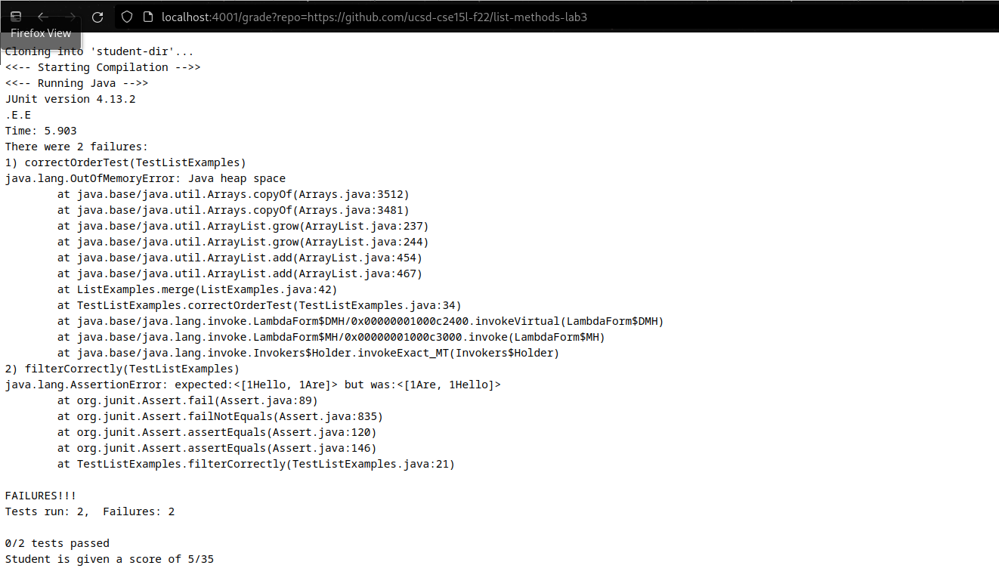
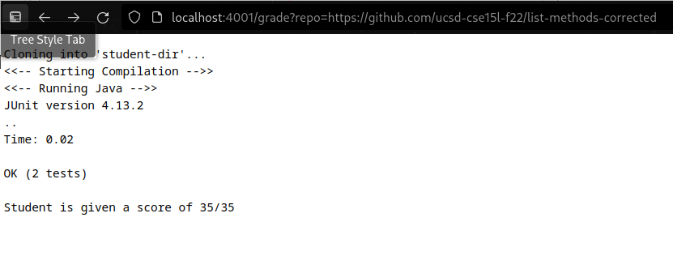
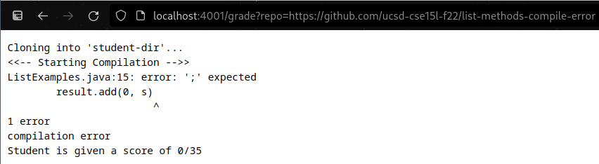

# Week 7 Lab Report
---

## The overview and examples


The following is the script for grading. There are a couple of missing scenarios, but still hit most marks.
I do have some experience with bash. Hell I'm writing this in a terminal using neovim right now. But writing these is still something I need more pratice for. When I spoke to others about this there seemed to be an amount of people surprised that I did not compile everything in the same directory I have my script and the other work. 

I believe that it is better management to compile the part of the students and the grader seprately. Even if I didn't, it might be better to add some permissions to the directory and the script. Last thing I want is for the server to begin running the student's code as a user that it shouldn't have access to. So yeah, the code will clone their repo, paste it into 'student-dir' directory, and then compile and run the tests inside. If it works, they get a full 35 points. If they don't... well they don't get as much.


*grade.sh*:

```
TOTAL_SCORE=0


function score_message(){

	printf "Student is given a score of $1/35 \n"
	exit 0
}

PREFIX=$PWD
CP=".:$PREFIX/lib/hamcrest-core-1.3.jar:$PREFIX/lib/junit-4.13.2.jar" # relative junit
TESTNAME="TestListExamples"
STUDENT_DIR="student-dir"

rm -rf $STUDENT_DIR 2> /dev/null

git clone $1 $STUDENT_DIR || exit 1 # names the repo $STUDENT_DIR 


set -o pipefail

INNARDS=$(ls ./$STUDENT_DIR)
# very bad case of a repo with just one subdirectory
if [[ -d ./$STUDENT_DIR/$INNARDS ]]; then
	STUDENT_DIR=$STUDENT_DIR/$INNARDS/
fi

cd ./$STUDENT_DIR/

# wrong name fix, one file expected though
#FIXME: I do not know how a file with multiple periods in filename may behave
badname=$(ls | cut -d '.' -f 1)
if [[ $badname.java != ListExamples.java ]]; then
	sed -i "s/${badname}/ListExamples/g" $badname.java
	mv $badname.java ListExamples.java > /dev/null
fi

cp $PREFIX/$TESTNAME.java ./


printf "<<-- Starting Compilation -->>\n"

javac -cp $CP *.java | tee output.txt

# check if their code compiled without errors
if [[ $? -ne 0 ]]; then
	
	echo compilation error
	score_message $TOTAL_SCORE

fi

# awarding them points for compiling
TOTAL_SCORE=$((TOTAL_SCORE + 5))


printf "<<-- Running Java -->>\n" 

java -cp $CP org.junit.runner.JUnitCore $TESTNAME | tee -a output.txt

# check if their code runs tests
if [[ $? -eq 0 ]]; then
	
	# awarding them full points
	TOTAL_SCORE=$((TOTAL_SCORE + 30))
else

	t=$(grep -i "Tests run" output.txt)
	tests=$(echo $t | cut -d ' ' -f 3 | cut -d ',' -f 1)
	failed=$(echo $t | cut -d ' ' -f 5)

	echo $t

	TOTAL_SCORE=$((TOTAL_SCORE + 15*(tests - failed))) # 15 is just the point per test in this example
fi

# Give a final score for the students
score_message $TOTAL_SCORE

```


Below is the server running the script on different repos. Essentially just grading their material. For starters is a repo that compiles, but does not pass the test. It only gets 5 points for compilation. That's it. Gives an error message too since I thought that would be helpful to the person reading it.



After is the corrected report. This one does not fail. So it gets a full 35 points. Simple as that. 



For the final one, the one below, this guy fails spectacurately. Almost as much as I spelling the word spectacularly. (I don't have an autocorrect plugin on neovim). His code does not compile. Probably forgot to push but based on the repo name he was more likely aware.
He gets 0 points. Student should of fixed it by now.




## Tracing the code


For starters there are a lot of lines. So excuse me if I skip one or two parts or group them together. Defining some variables are skipped.
We will take a look when we feed in the repo with the corrected methods. This would be the second example from the pictures above.

```
function score_message(){

	printf "Student is given a score of $1/35 \n"
	exit 0
}
```

Does what it says it does. There could be multiple times that the code can come up with a final score. That's why I wrote the function to keep the code DRY. Also exits, so be aware that it will give a final score for the student, then quit. The argument for `score_message` should always be the student score.
Also notice that it exits the script with exit code 0, since giving a score is the proper function of the script.


```
rm -rf $STUDENT_DIR 2> /dev/null
```

Remove the old student repo, the one from the previous student. I don't want the user to care if there was indeed one or not, so I throw any error message to the trash, "/dev/null". Goodbye into the void little guy. 

```
git clone $1 $STUDENT_DIR || exit 1
```

Does what it looks like. Tries to clone the student repo, which is an argument to the script *$1*. If it fails, well then it exits. That's what \|\| can be used for, as a conditional. Exits with an error too, since this shouldn't happen, and is probably due to the initial argument of the script being wrong. Also it is clones into *$STUDENT_DIR*, whatever you wish for that directory to be named it was named near the beginning of the script.

In our example it takes *https://github.com/ucsd-cse15l-f22/list-methods-corrected* as the repo and clones that one under the *$STUDENT_DIR* name. This line does output that it is cloning, and that behavior is seen in the example. Does not exit since it worked.

```
set -o pipefail
```

Consider a command fails. Consider that this command is piped into another command. That second command takes in the error and doesn't care. It says that everything is fine. But someone in that pipeline there was an error. Setting this makes sure if there is a failure anywhere in the pipeline we know that something went wrong. Since I use pipes I care about this and I do not want my script not to know this stuff.

```
INNARDS=$(ls ./$STUDENT_DIR)
# very bad case of a repo with just one subdirectory
if [[ -d ./$STUDENT_DIR/$INNARDS ]]; then
	STUDENT_DIR=$STUDENT_DIR/$INNARDS/
fi
```
Checks the case where the student put a directory inside the repo. So basically the code we intend on grading is nested. That is no good. First it checks if *$STUDENT_DIR* is populated with a single directory, and **if** there is and it is indeed a directory, then check inside that directory. Does not do this recursively. Does not check with multiple directories. And does check if there is indeed something inside the nested directory. It just checks that there is a single one nested inside the main one.

If that is the case then we're probably looking at the wrong directory for the repo, so *$STUDENT_DIR* changes to account for this.
But in our example the corrected commands are already in the correct directory. So instead the first variable just ends up being a file that is not a directory and skips the if statement contents.

```
cd ./$STUDENT_DIR/
```

Changes directory into that *$STUDENT_DIR*, wherever that is. Should be inside where we started though. Uses relative path.

```
badname=$(ls | cut -d '.' -f 1)
if [[ $badname.java != ListExamples.java ]]; then
	sed -i "s/${badname}/ListExamples/g" $badname.java
	mv $badname.java ListExamples.java > /dev/null
fi
```

So there is a bit more going on. First of all, now we are (or should be) in the directory with the file we intend to grade. But we check if it has the correct name, *"ListExamples.java"*. So we check if there is a .java file. It is probably of the form " *something.java* ", even if it does have the wrong name. So *$badname* is meant to isolate that part with the wrong name. The `cut` command divide them up at any period and takes in the first argument. `-d` means the delimiter sets to the next character, and the `-f` means to take in the field based on the number afte rit. In the part above that would be " *something.java* " ---> " *something* ". Anyways this is important for not just changing the file name.

So then we check if it is indeed is the wrong name. Then if it is the wrong name we have to do two things.

1) Rename anything with the badname inside the file to the correct one. || 2) Change the file name.

That's what each line does. `sed` replaces the contents in the file *$badname.java* by taking it as the input (`-i`), and then **s**ubstitutes when it sees **$badname** with **ListExamples** at all instances (**g**lobally).

Then the next line is just classic renaming in bash. Maybe the student should rename it, but I don't care so I just put if it does spit out a message, which I belive it doesn't, send it to the trash. Though I do think the behavior of the `move` command doesn't say anything. Hold up let me try it. Yeah it doesn't anyways, so that `> /dev/null` might be useless.


But our example has the correct name. The first line still gets the filename, but this time it's correct, so the if statement is false and the rest of that if statement is skipped. No output nor an error message.

```
cp $PREFIX/$TESTNAME.java ./
```

We're almost at the good stuff. This line just copies our testing file from our original directory, like the one with the script, and places it with the students. No output or error message.

```
printf "<<-- Starting Compilation -->>\n"
javac -cp $CP *.java | tee output.txt
```

Well first it echoes that the compilation is starting. Then it tries to compile all java files with junit. I want to user to see this as well so they know a little more, but also record it. So I pipe into the `tee` command. This one basically splits the output so the message will go into the file but also into the terminal.

For the example there is no output message for compiling, except the `printf` itself. No error message either.

```
if [[ $? -ne 0 ]]; then
	echo compilation error
	score_message $TOTAL_SCORE
fi
```

So here it is. Our last line uses a pipeline. Remember what command was used to change the behavior of the pipeline error? Anyways, so if the command, `javac` failed, then our code didn't compile completely and we have an exit code of nonzero. If that is the case, then the if statement is true and `then` we echo that there has been an error and give our user the final score of 0 as we exit (the `score_message` function behavior).

For our example this whole if statemetn is skipped because there was no error in our pipeline.

```
printf "<<-- Running Java -->>\n" 

java -cp $CP org.junit.runner.JUnitCore $TESTNAME | tee -a output.txt
```

Similar to the lines compiling. Again we let the user know we are now have reached runtime. Then runs java with junit, and we use the `tee` command to let the user know and also record the output of java. We use `-a` in order to append, not replace the contents of *output.txt*.

This time it again prints out the message of what is running. But, but this time the behavior of runnning the tests is also output to the terminal. There is no error for ours since all tests passed.

```
if [[ $? -eq 0 ]]; then
	
	# awarding them full points
	TOTAL_SCORE=$((TOTAL_SCORE + 30))
```

Great! The code has run just fine and has passed all tests. The exit code is 0, so we test that it is equal to 0. it is, so we award them 30 more points. And the other 5 were awarded after the compilation. 

This is what happens with our example since all of our tests passed the exit code is indeed 0.

```
else

	t=$(grep -i "Tests run" output.txt)
	tests=$(echo $t | cut -d ' ' -f 3 | cut -d ',' -f 1)
	failed=$(echo $t | cut -d ' ' -f 5)

	echo $t

	TOTAL_SCORE=$((TOTAL_SCORE + 15*(tests - failed))) # 15 is just the point per test in this example
fi

```

Oh god no. What could of happened? Well if there had been any tests not passed then we would take a look at the output message. Assuming the line with "Tests run" was output by junit and also contained the score, then we just take in that line as *$t* and break down the tests and failed scores. If there had been tests not passed then we would `echo` this line outputted by `grep`, then `cut` it up to isolate the amount of tests. Note that there is usually a comma there so defining *$tests* is piped into `cut` twice.

Similarly it takes in the 5th field of that line in order to count the number of tests *$failed*. Then it echoes out the actual line letting them know how many tetss were passed. It kind of hide the tests from them though. In retrospect it might of been useful to see the whole error message for the tests, but the script wasn't written line this this time. Also in retrospect the same message is printed since they outputted during the runtime. Oops? Anyways, it ends up by doing some arithmetic in order to calculate how many points the student will be awarded. Then it finishes.  


```
# Give a final score for the students
score_message $TOTAL_SCORE
```

As it says in the comment. Feeds the *$TOTAL_SCORE* into the function. That function does what it does, and prints the student his score and then exits.

For ours by this point we have ammassed the total score possible, so `35` is the argument fed into the function. We are given a score of 35/35, which the function prints out the terminal, and finally exit the script with an error code of 0.


[Link back](index.md)
